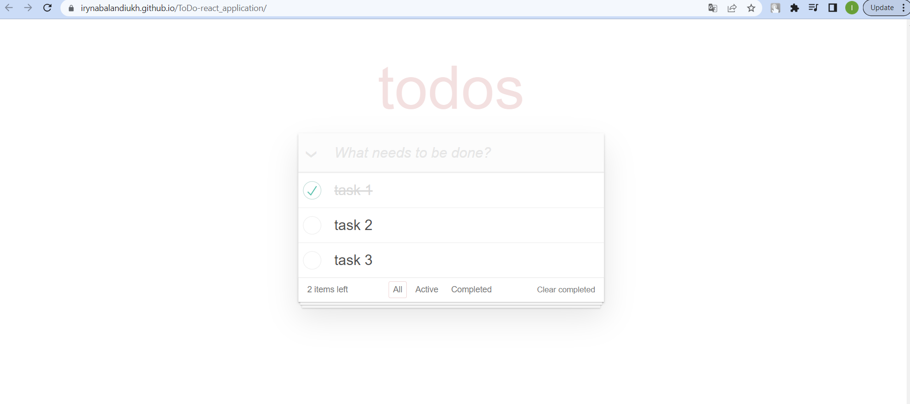
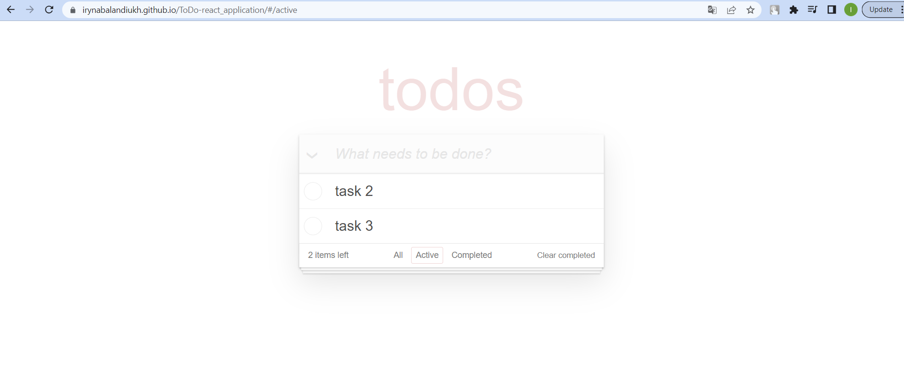

# Project Title: ToDo App

## Description
ToDo-app is a web application that was developed based on the React framework, which allows users to create, edit and mark completed tasks.
Developing this application I used functional component, hooks, forms, requests to REST API.

Using React technologies, the application provides fast and continuous interaction with the user. The interface of the application is simple and intuitive, which allows even new users to quickly master its functionality.

The main functionality of the application is to create lists of tasks. A user can add new tasks, edit existing ones, and mark tasks that have already been completed, which helps him visually track progress and achievements.

## Key Features
- Create, edit, and delete tasks
- Mark tasks as completed and track progress
- Filter tasks based on task status

## Technologies Used
- React.js: For building a dynamic and interactive user interface.
- REST API: For data communication and handling server requests.
- HTML, CSS, Bulma: For styling and layout.

## Installation
1. Clone the repository:
`git clone https://github.com/IrynaBalandiukh/ToDo-react_application.git`

2. Install dependencies:
`cd ToDo-react_application`
`npm install`

3. Run the development server:
`npm start`

## Demo
Check out the live demo of the ToDo App [here](https://irynabalandiukh.github.io/ToDo-react_application/).

## Screenshots

